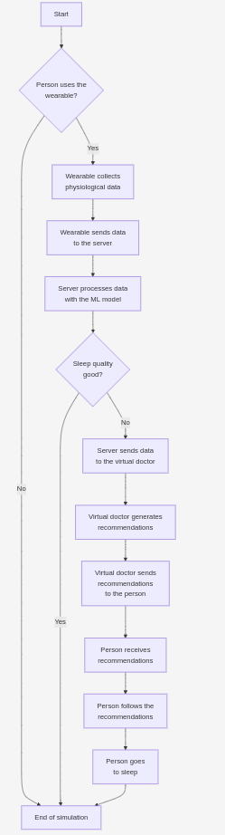

# BDI Agent-Based Sleep Quality Simulation

This project simulates the interaction between a person, a wearable device, a virtual doctor, and a server to assess and improve sleep quality using a Belief-Desire-Intention (BDI) agent framework.

## Project Structure
├── intelligence
│   ├── config
│   │   ├── bmi_encoder.pkl
│   │   ├── bp_encoder.pkl
│   │   ├── gender_encoder.pkl
│   │   ├── occupation_encoder.pkl
│   │   ├── random_forest_model.pkl
│   │   ├── scaler.pkl
│   │   └── sd_encoder.pkl
│   ├── env.py
│   ├── person.asl
│   ├── server.asl
│   ├── virtual_doctor.asl
│   └── wearable.asl
└── flow
└── flow.png

* **intelligence:** Contains the Python code for the BDI agent simulation.
    * **config:** Stores configuration files and trained machine learning models.
    * **env.py:** Sets up the simulation environment and runs the simulation.
    * **\*.asl:**  Files defining the behavior of each agent (person, server, virtual doctor, wearable).
* **flow:** Contains an image illustrating the simulation flow.

## How to Run

1. **Navigate to the project's root directory.** Make sure you are **outside** the `intelligence` folder.
2. **Execute the simulation:**
   ```bash
   python3 ./intelligence/env.py
   
* **Flow's Diagram.**

